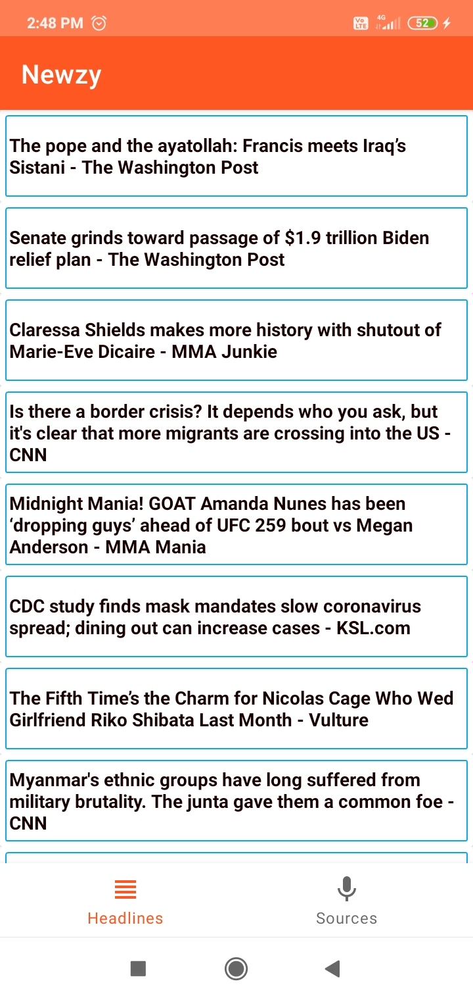
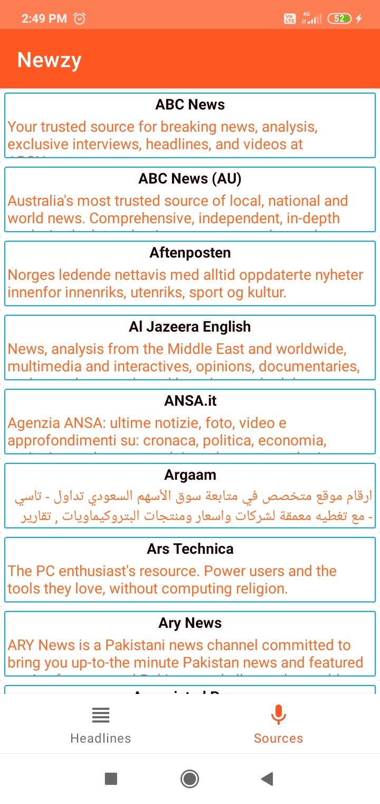

# Newzy-Android-Kotlin-MVVM-Top-Headlines-With-Good-RecyclerView-Effects-With-Bottom-Navigation-View

**ScreenRecording of Application** - https://youtu.be/hksVkhmCXSg

        

Newzy is an android application which is developed totally in **KOTLIN** language.

Following are some features of it - 

* Coded totally in **Kotlin**
* Implemented in **MVVM** design architecture/pattern
* Used **LiveData, ViewModel, RecyclerView** etc Android Architecture Components
* Used effects of **shrinking and fading** the cards when the recycler view gets scrolled up (https://youtu.be/hksVkhmCXSg)
* Implemented **Bottom-Navigation-View**
* Consumes APIs provides by NewsAPI site

**P.S.**
* The **apk** file is also added in **releases section** of this repo
* **Stars** are always appreciated 😜

